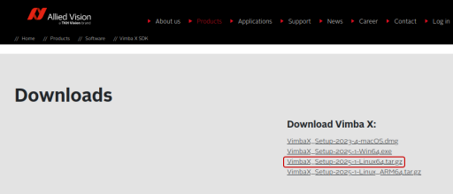
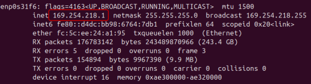
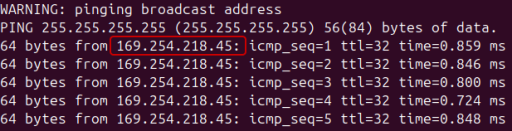
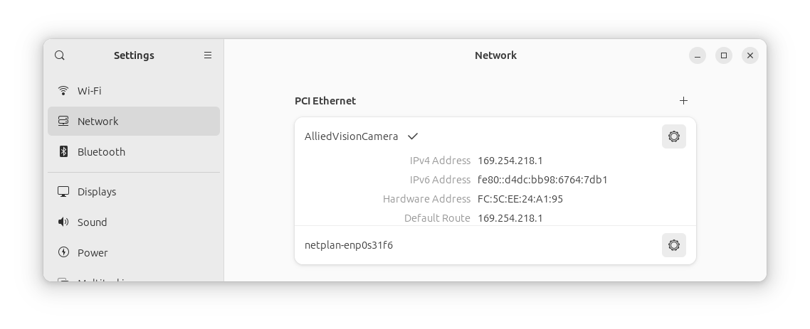
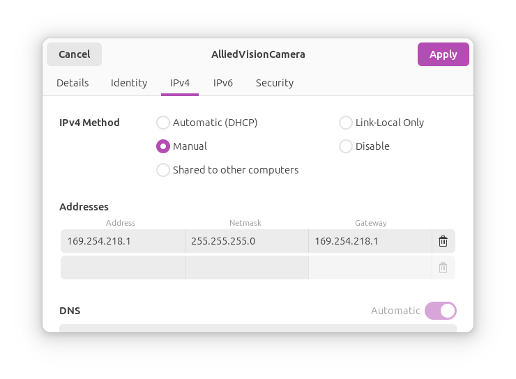

## Setup your Allied Vision Mako Camera:

1. Install Vimba X:
    1. download the [Vimba X SDK](https://www.alliedvision.com/en/products/software/vimba-x-sdk/)\
    
    1. extract content to desired location
    1. go to `./VimbaX_Setup-2025-1-Linux64/VimbaX_2024-1/cti` and execute `Install_GenTL_Path.sh` using sudo:
        ```terminal
        sudo ./Install_GenTL_Path.sh
        ```
    1. reboot your PC
1. Find the IPv4 address of your camera:
    - using `ifconfig`:\
    
    - or using `ping -b 255.255.255.255` (turn off your WiFi connection):\
    
1. Setup Network configuration
    1. go to `Settings > Network > PCI Ethernet`\
    
    1. click on `Add Ethernet Connection`
    1. go to tab `IPv4`
    1. set the `IPv4 Method` to manual
    1. add a line in Addresses with the IP Address of your camera in `Address` and `Gateway` and set the `Netmask` to `255.255.255.0`\
    
    1. click on apply and select the created connection
1. Start Vimba Viewer:
    1. launch Vimba Viewer from `./VimbaX_Setup-2025-1-Linux64/VimbaX_2024-1/bin/VimbaXViewer`
    1. if your camera is not detected automatically:
        1. click on `Action > Open Camera by IP`
        1. enter the IP address of your camera and click on `OK`

## Setup the python environment

Make sure to enter the correct path to your VimbaX installation, e.g., *../VimbaX_Setup-2025-1-Linux64/*\
```terminal
./setup-python-env.sh <VimbaX SDK Path>
```

## Execute the Discobox app

```terminal
./run-discobox.sh
```
(optional) The application can be executed with following arguments:
- Print help information:
    ```terminal
    ./run-discobox.sh -h
    ```
- List all connected cameras:
    ```terminal
    ./run-discobox.sh -l
    ```
- Run the `discobox.py` script with a specific camera:
    ```terminal
    ./run-discobox.sh <Camera ID>
    ```

## Develop using the Python API

1. Create a virtual environment:
    ```terminal
    python3 -m venv venv
    source ./venv/bin/activate
    pip install './VimbaX_Setup-2025-1-Linux64/VimbaX_2024-1/api/python/vmbpy-1.0.5-py3-none-any.whl[numpy,opencv]'
    ```
1. Run some examples:
    1. list all connected cameras:
        ```terminal
        python3 ./VimbaX_Setup-2025-1-Linux64/VimbaX_2024-1/api/examples/VmbPy/list_cameras.py
        ```
    1. test if you camera connection works:
        ```terminal
        python3 ./VimbaX_Setup-2025-1-Linux64/VimbaX_2024-1/api/examples/VmbPy/asynchronous_grab_opencv.py
        ```
